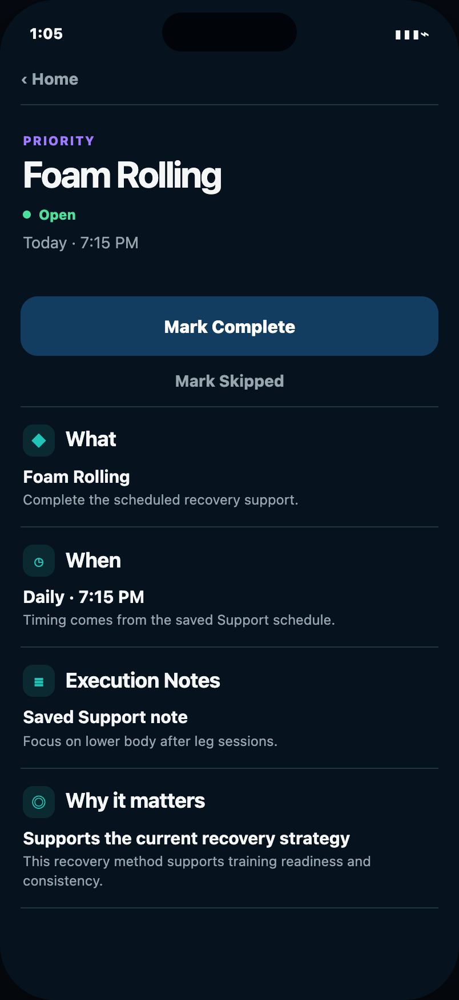
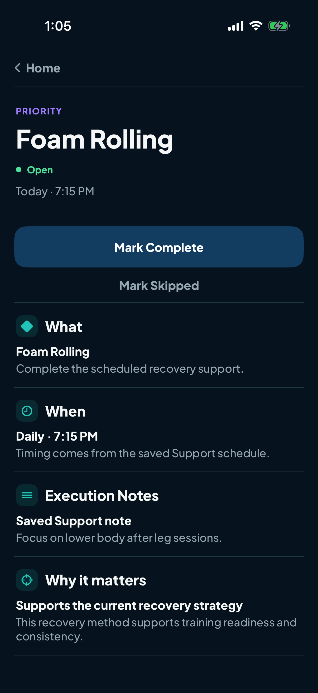
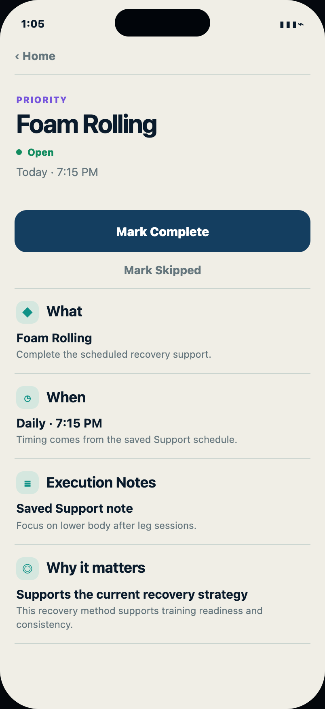
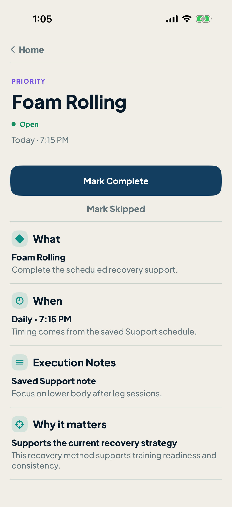

# Foam Rolling Priority Detail parity pilot

Status: **READY FOR FOUNDER REVIEW**. This is the first locked-design implementation pilot only. No other Priority Detail page was migrated.

Implementation commit: `b65deb00098713d824f14064e0362726997b5991`

## Dark

| Locked design | Real Native simulator |
|---|---|
|  |  |

## Mineral Light

| Locked design | Real Native simulator |
|---|---|
|  |  |

The design captures are the exact accepted references from `codex/priority-detail-ui-style-translation` at `1ff803ac`. The implementation captures are unmodified `XCUIScreen` output from the real SwiftUI screen on an iPhone 17 Pro simulator running iOS 26.5. Both represent the same 402 × 874 point viewport; the references are 2× and the simulator captures are 3×.

## Parity result

- Visual: hierarchy, spacing, prominence, grouping, typography scale, semantic colors, divider structure, section order, buttons, and custom 46-point Home crumb match the locked design in both appearances.
- Content/data: production continues to render the canonical Server occurrence. The deterministic capture seam is DEBUG-only and uses the audited canonical Foam Rolling values, ordering, copy, IDs, action semantics, and occurrence date.
- Behavior: the existing complete, skip-confirm/cancel, durable acknowledgement, notification reconciliation, terminal-state, loading/error, and back-navigation paths remain authoritative. The Server's exact setup-required `Review Support` href now maps to the existing Recovery Support destination.
- Accessibility: the primary action is at least 52 points high, the secondary action at least 44 points, headings retain traits, decorative symbols are hidden, and controls carry explicit labels.
- Scope: the locked treatment is selected only by canonical Foam Rolling identity. Every other Priority Detail remains on the Build 85 presentation.

No unresolved product-surface mismatch remains. See [parity mismatch ledger](PARITY-MISMATCH-LEDGER.md), [state coverage](STATE-COVERAGE.md), [implementation method](IMPLEMENTATION-METHOD.md), and [validation](validation.json).
