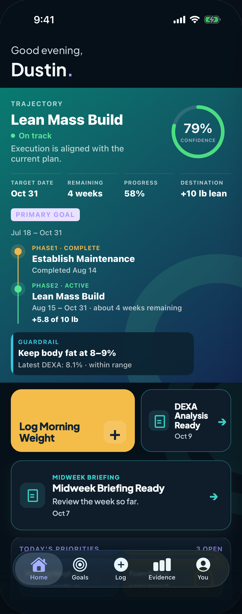
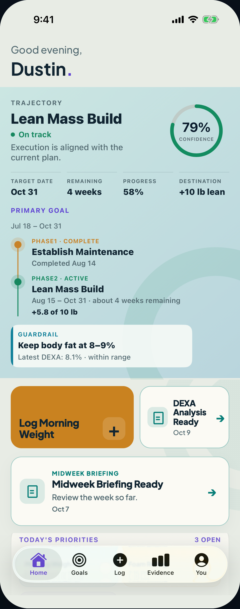
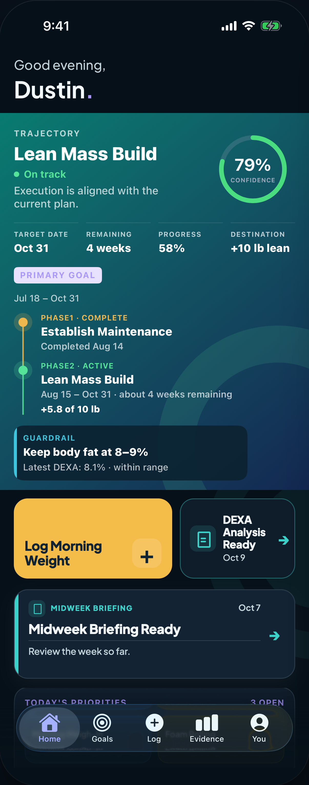
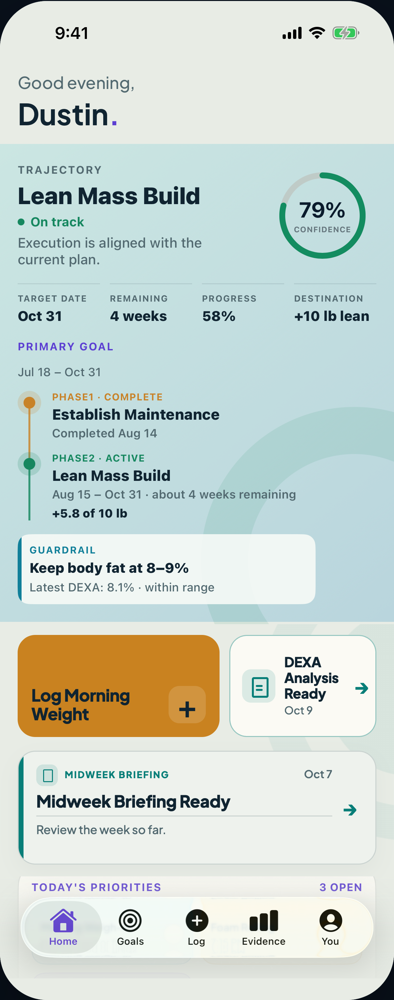

# Build 93 Home secondary briefing — two visual options

**Task authority:** `34c663fe`

**Prior audit:** `8adcefc7` / `20261009T230228Z-build93-home-secondary-briefing-card-audit.md`

**Sealed design artifact commit:** `30803809ed60cb629318cab9e24c315055631ecc`

**Released Native candidate preserved:** `9d0a206908fc3c4a64976e9cc3840e23cab0ba55`

**Scope:** visual design only. No shipping Native/Server source, fixture, production data, deployment, TestFlight build or release pointer changed.

## Invariants preserved in both options

- The current placement is unchanged: action + primary DEXA tile, then one full-width secondary Midweek card, then Today's Priorities.
- Server event-first / cadence-second order is unchanged.
- Exact representative production copy is unchanged: `DEXA Analysis Ready`, `Oct 9`, `Midweek Briefing`, `Midweek Briefing Ready`, `Review the week so far.`, `Oct 7`.
- The primary DEXA card retains the accepted compact Home briefing treatment.
- The secondary card remains one full-card tap target routed to its exact Midweek artifact.
- Neither option uses the legacy purple section eyebrow, brain badge or separate `View →` link.
- Both use the approved Home paper/ink/secondary-ink/teal vocabulary and 18 pt geometry.

## Option A — Family Card

The full-width card is a clear sibling of the primary DEXA tile: full-size teal document mark, quiet cadence label, title, prompt, date and one integrated trailing arrow on an 18 pt paper surface with a teal hairline.

### Default

- [Dark — direct PNG](https://raw.githubusercontent.com/dustinginn/physiqueos/30803809ed60cb629318cab9e24c315055631ecc/agent-handoffs/artifacts/build93-home-secondary-briefing-options-20261009/screens/option-a-dark.png)
- [Mineral Light — direct PNG](https://raw.githubusercontent.com/dustinginn/physiqueos/30803809ed60cb629318cab9e24c315055631ecc/agent-handoffs/artifacts/build93-home-secondary-briefing-options-20261009/screens/option-a-light.png)

### 135% briefing-type stress

- [Dark — direct PNG](https://raw.githubusercontent.com/dustinginn/physiqueos/30803809ed60cb629318cab9e24c315055631ecc/agent-handoffs/artifacts/build93-home-secondary-briefing-options-20261009/screens/option-a-dark-large.png)
- [Mineral Light — direct PNG](https://raw.githubusercontent.com/dustinginn/physiqueos/30803809ed60cb629318cab9e24c315055631ecc/agent-handoffs/artifacts/build93-home-secondary-briefing-options-20261009/screens/option-a-light-large.png)

## Option B — Editorial Rail

The secondary card becomes a compact editorial summary: a teal cadence rail, small document marker, inline date, stronger title and a ruled prompt. It is cohesive with Home but deliberately less tile-like, making its supporting rank more explicit.

### Default

- [Dark — direct PNG](https://raw.githubusercontent.com/dustinginn/physiqueos/30803809ed60cb629318cab9e24c315055631ecc/agent-handoffs/artifacts/build93-home-secondary-briefing-options-20261009/screens/option-b-dark.png)
- [Mineral Light — direct PNG](https://raw.githubusercontent.com/dustinginn/physiqueos/30803809ed60cb629318cab9e24c315055631ecc/agent-handoffs/artifacts/build93-home-secondary-briefing-options-20261009/screens/option-b-light.png)

### 135% briefing-type stress

- [Dark — direct PNG](https://raw.githubusercontent.com/dustinginn/physiqueos/30803809ed60cb629318cab9e24c315055631ecc/agent-handoffs/artifacts/build93-home-secondary-briefing-options-20261009/screens/option-b-dark-large.png)
- [Mineral Light — direct PNG](https://raw.githubusercontent.com/dustinginn/physiqueos/30803809ed60cb629318cab9e24c315055631ecc/agent-handoffs/artifacts/build93-home-secondary-briefing-options-20261009/screens/option-b-light-large.png)

## Side-by-side comparison

| Dimension | Option A — Family Card | Option B — Editorial Rail |
|---|---|---|
| Readability | Familiar left-to-right scan; cadence/title/prompt/date form one uninterrupted stack. The larger icon slightly reduces text width. | Strong title-first scan with date visible at the top. The prompt rule separates context cleanly and uses almost the full width. |
| Primary/secondary hierarchy | Clearly secondary by full-width placement and denser content, but intentionally reads as the same component family as DEXA. | Strongest rank distinction: the soft field and leading rail make it editorial support rather than a second primary tile. |
| Dark / Mineral parity | Near-identical semantic relationships in both themes; teal outline remains legible without dominating. | Soft surface rhythm is especially natural in Mineral Light; the rail and marker remain sufficient grouping cues in Dark. |
| Dynamic Type | At 135%, the title wraps to two lines, the card grows from 116 to 152 pt, and all copy/date/arrow remain unobstructed. | At 135%, title and prompt remain readable at 152 pt. The inline cadence/date row is sound, but it is the tighter of the two layouts and needs a deliberate accessibility-size stacking rule in SwiftUI. |
| VoiceOver model | Straightforward combined order: cadence → title → prompt → date → button hint. | Same combined label is possible, but visual date placement differs from spoken order and must be explicitly authored. |
| Implementation complexity | **Low.** Reuses the primary tile's icon, semantic colors, arrow and radius; adds only a full-width responsive arrangement. | **Medium.** Adds a new rail/soft-field/header-rule composition and an accessibility-size header reflow. |
| Risk | Lowest visual and implementation risk; least likely to reopen accepted Home grammar. | Still bounded, but more bespoke and therefore more likely to need fine tuning after physical review. |

## Recommendation

**Recommend Option A — Family Card.**

It resolves the confirmed legacy mismatch with the smallest, clearest extension of the already-approved Home briefing family. The primary DEXA tile remains visually dominant because it owns the compact action row, while the secondary card gains room for its cadence and prompt without introducing another visual dialect. Its reading order maps directly to VoiceOver, its 135% behavior is naturally vertical, and the eventual implementation should be a narrow Native-only change.

Option B is a credible alternative if the Founder wants a stronger editorial distinction between event and cadence briefings. Its hierarchy is excellent, particularly in Mineral Light, but the rail, inline date and ruled prompt create a new Home-specific component rather than simply completing the approved family.

## Render and verification evidence

These are real browser-rendered design-source screenshots from the repository's established HTML/Playwright preview method. The untouched upper and lower Home regions come from the accepted iPhone 17 Pro simulator captures; the bounded action/two-briefing region is rendered from the design source. They are not represented as shipping SwiftUI simulator captures.

- [Complete comparison board](https://raw.githubusercontent.com/dustinginn/physiqueos/30803809ed60cb629318cab9e24c315055631ecc/agent-handoffs/artifacts/build93-home-secondary-briefing-options-20261009/comparison-board.png)
- [Artifact README](https://raw.githubusercontent.com/dustinginn/physiqueos/30803809ed60cb629318cab9e24c315055631ecc/agent-handoffs/artifacts/build93-home-secondary-briefing-options-20261009/README.md)
- [Design source](https://raw.githubusercontent.com/dustinginn/physiqueos/30803809ed60cb629318cab9e24c315055631ecc/agent-handoffs/artifacts/build93-home-secondary-briefing-options-20261009/source/options.html)
- [Renderer](https://raw.githubusercontent.com/dustinginn/physiqueos/30803809ed60cb629318cab9e24c315055631ecc/agent-handoffs/artifacts/build93-home-secondary-briefing-options-20261009/source/render-screens.mjs)

Final automated measurements across all eight screenshots:

- iPhone content width: exactly 402 pt / 1,206 px at 3x;
- default card: 366 × 116 pt;
- 135% type-stress card: 366 × 152 pt;
- horizontal overflow: 0;
- vertical overflow: 0;
- all eight screenshots visually inspected after the final crop correction;
- default output: 1,206 × 3,057 px;
- type-stress output: 1,206 × 3,261 px.

The taller-than-device images intentionally show the inserted full-width card in the Home scroll continuum at the default iPhone width; they do not compress or move the surrounding hierarchy to force it into one viewport.

## Founder decision requested

Choose **Option A — Family Card** or **Option B — Editorial Rail**. No implementation should begin until an option is explicitly approved.

`DESIGN_ONLY` · `PLACEMENT_PRESERVED` · `BEHAVIOR_PRESERVED` · `DARK_RENDERED` · `MINERAL_RENDERED` · `TYPE_STRESS_RENDERED` · `OPTION_A_RECOMMENDED` · `NO_NATIVE_CHANGE` · `NO_SERVER_CHANGE` · `NO_RELEASE_CHANGE`
