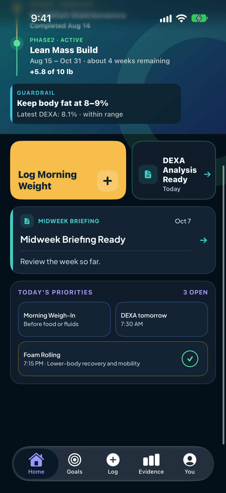
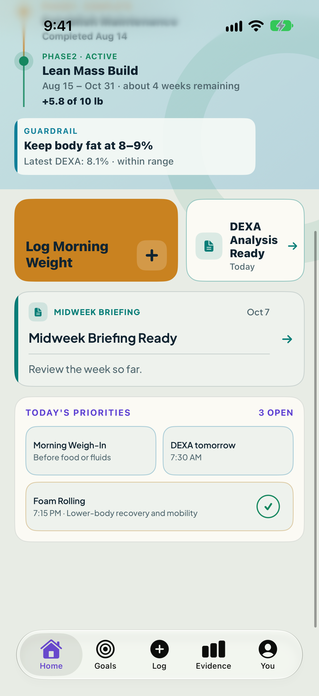

# Build 93 Home secondary briefing — Option B implementation candidate

**Task authority:** `3bd19757`

**Released Build 93 Native base:** `9d0a206908fc3c4a64976e9cc3840e23cab0ba55`

**Approved design source:** `30803809ed60cb629318cab9e24c315055631ecc` — Option B, Editorial Rail

**Tested isolated Native candidate:** `b1535c7d558a7e16a4098110c575de26734840bb`

**Candidate branch:** `codex/native-home-secondary-briefing-option-b-20261009`

**Scope:** next-build Native candidate and focused acceptance evidence only. No Server product change, production mutation, Build 93 release-pointer change, build-number bump, archive, deployment, upload or TestFlight release occurred.

## Result

`PASS` — the Founder-selected Option B Editorial Rail is implemented as an isolated Native candidate. It replaces only the legacy presentation used for briefing cards after the event-first primary card. The existing Home hierarchy, Server array order, exact card copy/date, destination identity and whole-card interaction remain intact.

The implementation matches the approved design:

- 5 pt teal editorial rail and teal `doc.text.fill` marker;
- cadence/date header, stronger title, ruled prompt and integrated trailing arrow;
- 18 pt continuous radius on the redesign soft surface;
- full-width secondary placement immediately below the primary DEXA tile;
- accessibility-size header reflow and vertically expanding title/prompt;
- explicit VoiceOver order: cadence → title → prompt → date, with a navigation hint only when navigable.

`HomeView` was not changed. It still renders `briefingCards.first` as the compact primary DEXA strip and `dropFirst()` as full-width secondary cards, so event-first ordering and the approved placement remain source-owned invariants.

## Real simulator screenshots

- [Dark — direct PNG](https://raw.githubusercontent.com/dustinginn/physiqueos/main/agent-handoffs/artifacts/build93-home-secondary-briefing-option-b-implementation-20261009/screens/home-secondary-editorial-rail-dark.png)
- [Mineral Light — direct PNG](https://raw.githubusercontent.com/dustinginn/physiqueos/main/agent-handoffs/artifacts/build93-home-secondary-briefing-option-b-implementation-20261009/screens/home-secondary-editorial-rail-mineral-light.png)

Both are unedited XCTest attachments from the tested SwiftUI app, 1206 × 2622 px. Hashes and provenance are recorded in the [artifact README](../artifacts/build93-home-secondary-briefing-option-b-implementation-20261009/README.md).

## Focused implementation envelope

The candidate changes exactly six Native files:

1. `BriefingCardView.swift` implements the Editorial Rail and explicit accessibility contract.
2. `HomeRedesignReviewFixture.json` adds the exact DEXA-first / Midweek-second two-briefing acceptance state.
3. `HomeAPI.swift` adds a DEBUG-only stress seam for long text and 2+ secondary rails; production decoding is unchanged.
4. `HomeReadModelTests.swift` covers fixture order/destinations, approved geometry and VoiceOver reading order.
5. `FounderServerAPITests.swift` proves production Home preserves event-first order and canonicalizes every briefing to its own artifact ID.
6. `FoamRollingPriorityDetailUITests.swift` covers Dark/Mineral rendering, placement, whole-card navigation, Accessibility XXXL, long copy and three secondary rails.

No Xcode project, version/build metadata, release configuration, Server source or deployment tooling changed.

## Verification

Environment: Xcode 27.0 (`27A266a`), `B91 Evidence iPhone 17 Pro`, iOS 27.0 simulator (`B84D6637-58FA-4671-BDB1-96D0EFFD6136`). Xcode work was serialized after confirming there was no active build in the Recovery lane.

### Focused unit contract — passed

Result bundle: `physiqueos-option-b-unit.xcresult`

- `HomeReadModelTests.testRedesignReviewFixturePreservesLockedHomeInformationContract`
- `HomeReadModelTests.testSecondaryBriefingEditorialRailKeepsApprovedGeometryAndAccessibleReadingOrder`
- `FounderServerAPITests.testProductionHomePreservesEventFirstBriefingOrderAndEveryDestination`

Machine result: **3 passed, 0 failed, 0 skipped**.

### Dark + Mineral Light appearance and navigation — passed

Result bundle: `physiqueos-option-b-appearance.xcresult`

- `FoamRollingPriorityDetailUITests.testHomeSecondaryBriefingEditorialRailDarkAndMineralLightNavigates`

The single test exercised both appearances. It asserted DEXA above Midweek, full-width 118 pt minimum geometry, the full spoken label, captured both screenshots, tapped the teal-rail side of the card, and verified the exact Midweek detail verdict.

Machine result: **1 passed, 0 failed, 0 skipped**.

### Dynamic Type, long copy and 2+ secondary cards — passed

Result bundle: `physiqueos-option-b-stress-rerun.xcresult`

- `FoamRollingPriorityDetailUITests.testHomeSecondaryBriefingHandlesAccessibilityTypeLongCopyAndMultipleRails`

At Accessibility XXXL the test asserted three ordered full-width secondary rails, equal widths, complete long-copy accessibility labels, a taller long-copy card rather than truncation, and a hittable visible region.

Machine result: **1 passed, 0 failed, 0 skipped**.

The first stress attempt exposed a test-helper assumption: it required an intentionally oversized Accessibility XXXL card to fit completely inside one viewport and oscillated between scroll positions. All product/layout assertions preceding that helper had passed. The helper was narrowed to the correct acceptance requirement—expose a hittable region—and the isolated rerun passed. This was a harness correction, not a product correction.

Additional checks: JSON fixture parse passed; `git diff --check` passed; candidate worktree clean after commit; both screenshots visually inspected at original resolution.

## Review and rollback

Acceptance review should focus on whether the real SwiftUI captures faithfully express the selected Editorial Rail hierarchy. Functional risk is bounded: Server selection and copy are untouched, production destination canonicalization is explicitly tested, and the stress fixture seam is DEBUG-only.

Rollback is one Native candidate revert: `git revert b1535c7d558a7e16a4098110c575de26734840bb`. This restores the previous secondary-card presentation and fixture/tests without changing Founder data, Server briefing selection, Build 93, or any released binary.

## Gates preserved

`NEXT_BUILD_ONLY` · `OPTION_B_IMPLEMENTED` · `PLACEMENT_PRESERVED` · `EVENT_FIRST_ORDER_PRESERVED` · `NAVIGATION_VERIFIED` · `VOICEOVER_VERIFIED` · `DYNAMIC_TYPE_VERIFIED` · `DARK_CAPTURED` · `MINERAL_LIGHT_CAPTURED` · `NO_SERVER_PRODUCT_CHANGE` · `NO_PRODUCTION_WRITE` · `NO_BUILD_BUMP` · `NO_TESTFLIGHT` · `NO_RELEASE_POINTER_CHANGE`
